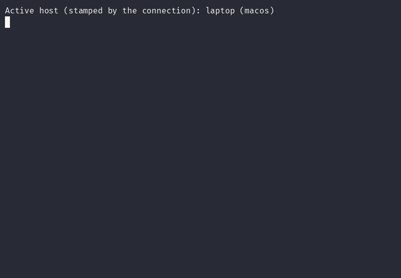
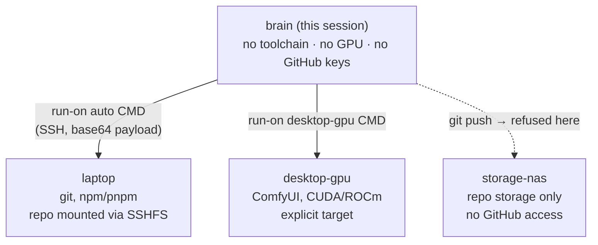

**Give your headless coding agent a body.**

`run-on` is a tiny dispatcher (~200 lines of bash) that routes a command from a brain-only
agent — a container or VM with no build toolchain, no GPU, no GitHub credentials — to whichever
machine on your network actually owns the resource the command needs: a laptop with the compiler,
a desktop with the GPU, a NAS with the disk.

```bash
run-on auto "pnpm install && pnpm build"    # runs on the laptop that owns the repo
run-on auto npx vitest run                  # same
run-on desktop-gpu "python train.py"        # explicit target: the machine with the GPU
run-on auto git push -u origin my-branch    # network git, correct SSH identity, no key confusion
```



_Real session, hostnames/IPs replaced with placeholders. `which-host` lists the registry and
reachability; `run-on auto` picks the reachable host and runs the command there._

## Why this exists

Most "Claude Code homelab" setups move the _agent_ to the machine that has the toolchain — one
big always-on container with everything installed. That works until your hardware is
heterogeneous: a low-power NAS/VM as the stateless brain, a Mac for `npm`/`git`, a Windows gaming
PC for GPU work. Installing every toolchain in the brain container doesn't scale, and duplicating
state across machines defeats the point of having one brain.

`run-on` inverts it: **one stateless brain, N pairs of hands.** The agent never needs a local
toolchain — it just describes what to run, and `run-on` figures out which physical machine should
run it, over SSH, using that machine's real PATH (homebrew/nvm/volta) and its real filesystem
paths.



## How it decides where to run

1. **If the current directory is an SSHFS-mounted repo**, run on the machine that actually owns
   that repo, at its real local path (a native build, not a remote copy) — set up with
   `mount-repo`.
2. **Otherwise**, try an optional "active host" hint (see [Limitations](#limitations)), then the
   next reachable host in a configured priority order (`config/hosts.json`).
3. **If nothing is reachable**, fail loudly (`exit 3`) instead of silently falling back to running
   a build on the brain against a possibly-stale SSHFS view. Opt into that fallback explicitly
   with `RUNON_FALLBACK_LOCAL=1` or `run-on local`.
4. A host tagged `"role": "storage"` (e.g. a NAS with no GitHub access) is skipped for network git
   commands (`push`/`fetch`/`pull`/`clone`) with a clear error, instead of a misleading
   "unreachable".

## Install

```bash
git clone https://github.com/Catskan/run-on.git
cd run-on
sudo cp run-on which-host mount-repo umount-repo /usr/local/bin/
sudo mkdir -p /usr/local/lib && sudo cp lib/nas-remote.sh /usr/local/lib/
mkdir -p ~/.config/run-on
cp config/hosts.json.example ~/.config/run-on/hosts.json   # edit with your real hosts
ssh-keygen -t ed25519 -f ~/.ssh/id_run_on_clients -N ""     # passphrase-less key for automation
# authorize that key on every target machine's ~/.ssh/authorized_keys
```

Requires `bash`, `ssh`, `sftp`, `jq`, `sshfs` (optional, only for `mount-repo`). Tested with macOS
and Windows (OpenSSH + PowerShell) as remote targets; the dispatcher itself runs anywhere bash
does.

## Limitations

Straight answers to "is this actually usable as-is":

- **Yes, standalone.** Explicit targeting (`run-on <host> "<cmd>"`), the SSHFS-mounted-repo case,
  and the ordered-fallback `auto` all work with nothing beyond this repo + a `hosts.json`.
- **The "active host" hint is opt-in and unwired by default.** `run-on auto` will prefer
  `~/.config/run-on/active-host` if that file exists and names a reachable host — but nothing in
  this repo writes it. It exists so you can wire your _own_ connection wrapper to stamp it (one
  line: `ssh brain-host "echo laptop > ~/.config/run-on/active-host"` at connect time). Without
  that, `auto` just uses the ordered fallback, which is fine for most setups.
- **No "redirect my `claude`/`codex` command to a remote brain" shim included.** That's a separate,
  more opinionated concern (how you get _into_ the brain machine — SSH+tmux, a Discord bot,
  whatever) from how the brain dispatches work once it's running. Bundling it here would turn a
  200-line dispatcher into a full deployment kit. If there's demand, it's a candidate for its own
  repo layered on top of this one — not a reason to hold this one back.
- **`mount-repo` needs `sshfs`/macFUSE installed on the brain machine** — not bundled (packaging
  varies too much by OS to script reliably).
- Windows as a **target** is supported (PowerShell exec path); Windows as the **brain** running
  `run-on` itself is untested.

## What this is not

This is not a job scheduler, not a container orchestrator, not a remote-build cache. It has no
retry queue, no UI, no daemon. It is a dispatcher: one command in, one SSH connection out, exit
code back. That's deliberate — the agent already has a state machine (the conversation); `run-on`
just needs to not get in the way of it.

## Two real bugs this ran into

Short version: a wrong SSH key silently authenticating as the wrong GitHub account, and argument
quoting across a `bash → base64 → ssh → remote shell` pipeline. Both fixed, both explained in
detail (root cause + fix) in [docs/bugs.md](docs/bugs.md) — kept out of this README so it stays a
quickstart, not a postmortem.

## License

MIT — see [LICENSE](LICENSE).
